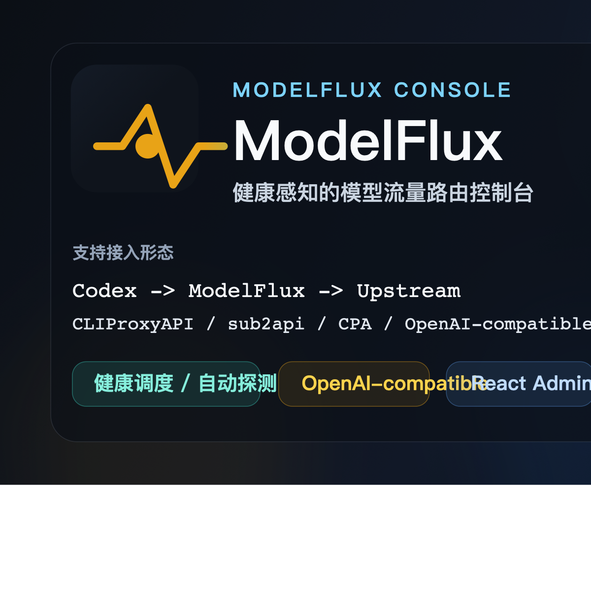
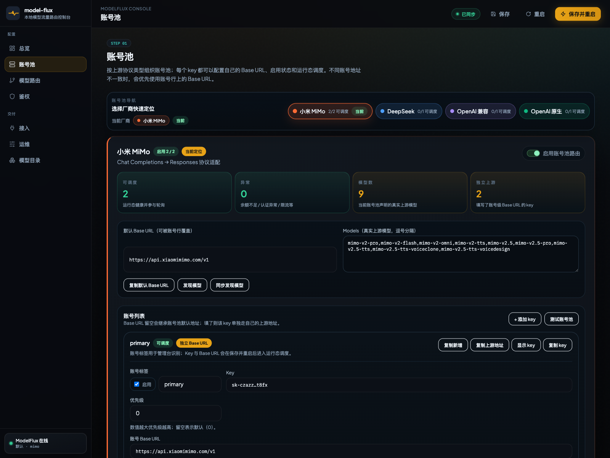

<p align="center">
  
</p>

<h1 align="center">ModelFlux</h1>

<p align="center">
  面向 Codex、CLIProxyAPI、sub2api、CPA 以及其它 OpenAI-compatible 客户端 / 前置代理的健康感知模型流量路由。
</p>

<p align="center">
  <a href="#核心能力">核心能力</a> ·
  <a href="#快速开始">快速开始</a> ·
  <a href="#docker-运行">Docker 运行</a> ·
  <a href="#接入方式">接入方式</a> ·
  <a href="./README.md">English</a>
</p>

> ModelFlux 的定位很明确：把客户端入口统一成一个可复用的 OpenAI-compatible 端点，把协议适配、账号池调度、故障隔离和恢复探测都收敛在同一个位置。

## 为什么是 ModelFlux

- 给多个客户端 / 前置代理提供统一稳定的 OpenAI-compatible 接入点
- 账号池具备健康调度、冷却、探测、故障切换与自动恢复能力
- 管理台可维护账号池、模型路由、鉴权、测试与重启
- 可直连，也适合 CLIProxyAPI、sub2api、CPA 等前置链路

## 管理台预览



## 核心能力

- **OpenAI-compatible 入站入口**：对外提供 `/v1/responses` 与 `/v1/chat/completions`，可被 Codex、CLIProxyAPI、sub2api、CPA 或其它兼容客户端调用。
- **Chat Completions 适配**：将 Responses 请求转换为上游 `/chat/completions` 请求，并把非流式/流式结果转换回 Responses 结构。
- **模型路由与别名**：用 `MODEL_ALIASES` 把客户端模型名映射到真实上游模型，例如 `gpt-5.5=mimo:mimo-v2-pro`。
- **健康感知账号池调度**：只调度健康 key；余额不足、认证异常、限流、超时、5xx 会自动分类、冷却、探测恢复。
- **管理台**：`/admin` 可维护账号池、key、独立 Base URL、模型映射、入站鉴权、链路测试和运行状态。
- **前置代理友好**：ModelFlux 不绑定某个固定链路；直连、CLIProxyAPI、sub2api 或其它 OpenAI-compatible 前置代理都可以把上游指向 ModelFlux。

## 支持的接入形态

ModelFlux 的核心不是固定某一种前置代理链路，而是提供一个可复用的 OpenAI-compatible 模型流量入口。只要前置组件或客户端能配置 `base_url`、`api_key`、`model`，并支持 Responses 或 Chat Completions，就可以接入。

```text
Codex -> ModelFlux -> upstream provider
Codex -> CLIProxyAPI -> ModelFlux -> upstream provider
Codex / client -> sub2api -> ModelFlux -> upstream provider
OpenAI-compatible client / CPA -> ModelFlux -> upstream provider
```

ModelFlux 统一负责入站鉴权、模型别名、协议适配、上游账号池调度和异常账号恢复；Codex、CLIProxyAPI、sub2api 只是可选的入口或前置代理。

## 品牌与文档素材

- 分享图：`./docs/assets/og-card.png`
- 可编辑矢量源：`./docs/assets/og-card.svg`
- 最新管理台截图：`./docs/assets/console-providers.png`

## 快速开始

```bash
cp env.example .env
npm install
npm run build
npm start
```

默认监听：

```text
http://127.0.0.1:19090
```

管理台：

```text
http://127.0.0.1:19090/admin
```

## Docker 运行

项目内置 `Dockerfile` 与 `docker-compose.yml`。默认容器内监听 `19090`，宿主机映射到 `127.0.0.1:19090`，避免和其它本机服务冲突。容器启动入口会在每次进程启动时读取挂载的 `/app/.env`，因此管理台保存配置后触发重启可以加载新配置。

```bash
cp env.example .env
# 按需编辑 .env：至少配置 PROXY_AUTH_KEY 和一个上游 key
docker compose up -d --build
```

访问：

```text
http://127.0.0.1:19090/health
http://127.0.0.1:19090/admin
```

如果需要修改宿主机端口，在 `.env` 中设置：

```bash
HOST_PORT=19090
BIND_HOST=0.0.0.0
PROXY_PORT=19090
```

至少配置一个上游 key，例如：

```bash
PROXY_AUTH_KEY=mf-local-CHANGE_ME
DEFAULT_PROVIDER=mimo
MODEL_ALIASES=gpt-5.5=mimo:mimo-v2-pro,gpt-5.4=mimo:mimo-v2-pro
MIMO_API_KEY=your-mimo-api-key
MIMO_BASE_URL=https://api.xiaomimimo.com/v1
MIMO_MODELS=mimo-v2-pro,mimo-v2-flash,mimo-v2-omni,mimo-v2-tts
```

## 接入方式

先判断**发起请求的程序运行在哪里**。这是最容易配错的地方：

| 调用方位置 | 应使用的 ModelFlux 地址 | 适用场景 |
|---|---|---|
| 宿主机 / 本机进程 | `http://127.0.0.1:19090/v1` | Codex 直连、本机 CLIProxyAPI、本机 CPA、curl、SDK |
| Docker Compose / Docker network 内的容器 | `http://model-flux:19090/v1` | 同 compose/network 里的 sub2api 或其它代理容器 |
| 其它机器或公网反代 | `http://<ModelFlux 所在机器 IP 或域名>:19090/v1` | 局域网机器、公网域名、反向代理 |

> 注意：容器里的 `127.0.0.1` 指的是容器自己，不是宿主机，也不是 ModelFlux。反过来，宿主机上的本机程序通常也不能解析 Docker service name `model-flux`。
>
> 如果 sub2api 和 ModelFlux 是两个独立 `docker compose` 栈，不能只把 sub2api 里的 `base_url` 写成 `http://model-flux:19090/v1`。必须先让 ModelFlux 加入 sub2api 所在 Docker network，并且如果 sub2api 设置了 `HTTP_PROXY` / `HTTPS_PROXY`，要把 `model-flux` 加入 `NO_PROXY` / `no_proxy`，否则服务名请求可能被代理转走并返回 `502 Bad Gateway`。
>
> sub2api 里这个指向 ModelFlux 的 OpenAI-compatible 上游账号应关闭代理/不绑定代理。它访问的是本机 Docker 网络里的 ModelFlux，不应该再走 Clash、HTTP 代理或其它外部代理。

### 宿主机 / 本机直连 ModelFlux

适合 Codex、CPA 或任意运行在宿主机上的 OpenAI-compatible 客户端：

```text
base_url = http://127.0.0.1:19090/v1
api_key  = <ModelFlux 的 PROXY_AUTH_KEY>
model    = gpt-5.5 或其它别名模型
```

### 宿主机 / 本机 CLIProxyAPI -> ModelFlux

如果本机已经用 CLIProxyAPI 统一管理 Codex provider，可以在 CLIProxyAPI 中新增一个 OpenAI-compatible 上游，指向宿主机映射端口：

```text
upstream_base_url = http://127.0.0.1:19090/v1
upstream_api_key  = <ModelFlux 的 PROXY_AUTH_KEY>
upstream_model    = gpt-5.5 或其它别名模型
```

### 容器内 sub2api -> ModelFlux

如果 sub2api 和 ModelFlux 在同一个 Docker Compose / Docker network 内，在 sub2api 中新增一个 OpenAI-compatible/API key 类型上游账号，地址使用服务名：

```text
base_url = http://model-flux:19090/v1
api_key  = <ModelFlux 的 PROXY_AUTH_KEY>
model    = gpt-5.5 或其它别名模型
proxy    = 不绑定代理 / 关闭代理
```

客户端仍然使用 sub2api 分配的 key，sub2api 只作为可选前置代理；ModelFlux 继续负责路由和上游账号池。

如果 sub2api 是独立 compose 栈，可以用项目内的可选 override 把 ModelFlux 挂到 sub2api 网络：

```bash
# 确认 sub2api 网络名，默认通常是 sub2api-deploy_sub2api-network
docker network ls | grep sub2api

# 在 ModelFlux 项目目录执行
SUB2API_DOCKER_NETWORK=sub2api-deploy_sub2api-network \\
docker compose -f docker-compose.yml -f docker-compose.sub2api.yml up -d
```

同时在 sub2api 容器环境里确认：

```text
NO_PROXY=localhost,127.0.0.1,::1,postgres,redis,sub2api,host.docker.internal,model-flux
no_proxy=localhost,127.0.0.1,::1,postgres,redis,sub2api,host.docker.internal,model-flux
```

验证容器内链路：

```bash
docker exec sub2api sh -lc 'curl -sS http://model-flux:19090/health'
```

如果 sub2api 不是容器内服务，而是直接运行在宿主机上，则应改用：

```text
base_url = http://127.0.0.1:19090/v1
```

### 其它 OpenAI-compatible 客户端

本机工具：

```bash
OPENAI_BASE_URL=http://127.0.0.1:19090/v1
OPENAI_API_KEY=<ModelFlux 的 PROXY_AUTH_KEY>
OPENAI_MODEL=gpt-5.5
```

容器内工具：

```bash
OPENAI_BASE_URL=http://model-flux:19090/v1
OPENAI_API_KEY=<ModelFlux 的 PROXY_AUTH_KEY>
OPENAI_MODEL=gpt-5.5
```

## 配置说明

### 入站鉴权

| 变量 | 说明 |
|---|---|
| `PROXY_AUTH_KEY` | 单一入站 key，适合客户端或前置代理只连一个 ModelFlux 上游的场景 |
| `PROXY_KEYS` | 多入站 key，格式为 `<key>:<provider>`，provider 可为 `mimo/deepseek/compat/openai/*` |
| `ADMIN_AUTH_KEY` | 管理台二次口令；不设置时只建议本机绑定使用 |

### 管理台鉴权弹窗

访问 `http://127.0.0.1:19090/admin` 时，如果 `.env` 中配置了 `ADMIN_AUTH_KEY`，页面会在首次加载管理 API 时弹出“管理鉴权”。这是正常保护机制，用来避免未授权用户读取配置、查看账号池状态、测试账号 key 或触发重启。

获取当前管理口令：

```bash
cd /Users/tyit-db/personal/AI/project/sub2api-deploy/model-flux
grep '^ADMIN_AUTH_KEY=' .env
```

把等号后的值填入弹窗即可。前端会把它保存到浏览器 `localStorage` 和 cookie `modelflux_admin_key`，后续访问会自动携带。

本机开发阶段如果不想弹窗，可以清空 `.env` 中的管理口令并重启容器：

```bash
ADMIN_AUTH_KEY=
docker compose restart
```

不要把 `ADMIN_ENABLED` 设为 `0` 来规避弹窗；那会禁用管理 API，管理台大部分功能将不可用。发布、局域网访问或反代到公网前，建议重新设置强 `ADMIN_AUTH_KEY`。

### 上游账号池

| 账号池 | Key | 默认 Base URL | Models |
|---|---|---|---|
| MIMO | `MIMO_API_KEY` / `MIMO_API_KEYS` | `MIMO_BASE_URL` | `MIMO_MODELS` |
| DeepSeek | `DEEPSEEK_API_KEY` / `DEEPSEEK_API_KEYS` | `DEEPSEEK_BASE_URL` | `DEEPSEEK_MODELS` |
| OpenAI-compatible | `COMPAT_API_KEY` / `COMPAT_API_KEYS` | `COMPAT_BASE_URL` | `COMPAT_MODELS` |
| OpenAI 原生 | `OPENAI_API_KEY` / `OPENAI_API_KEYS` | `OPENAI_BASE_URL` | `OPENAI_MODELS` |

`*_API_KEYS` 支持多个 key，也支持给单个 key 指定独立 Base URL：

```bash
MIMO_API_KEYS=key-2|backup|enabled|https://region-a.example/v1,key-3|old|disabled|https://region-b.example/v1
```

格式：`key|label|enabled`、`key|label|disabled`，或 `key|label|enabled|base_url`。不写第 4 段时使用账号池默认 Base URL。

### 模型别名

```bash
MODEL_ALIASES=gpt-5.5=mimo:mimo-v2-pro,gpt-5.4=mimo:mimo-v2-pro
```

路由优先级：

1. `MODEL_ALIASES` 明确映射
2. 账号池模型列表精确命中
3. 模型名称提示，例如包含 `mimo` 或 `deepseek`
4. `OPENAI_MODEL_PREFIXES`
5. `DEFAULT_PROVIDER`

## 账号池调度

每个上游 key 都会维护运行态：

| 状态 | 含义 |
|---|---|
| `healthy` | 可调度 |
| `probing` | 等待或正在恢复探测 |
| `insufficient_balance` | 余额不足，长冷却 |
| `rate_limited` | 限流，短冷却 |
| `auth_error` | 认证或权限异常，长冷却 |
| `temporary_error` | 5xx、EOF、timeout 等临时异常，短冷却 |
| `manual_disabled` | 管理台手动禁用，不自动恢复 |

调度策略：

- 只从健康、启用、未冷却的账号中选择。
- 优先选择当前并发最低的账号。
- 同等负载时选择最近最少使用的账号。
- 单次请求会自动尝试下一个可用账号；所有账号失败时才返回聚合错误。
- 冷却结束后自动进入探测，恢复成功后重新加入调度池。

相关调优变量：

```bash
ACCOUNT_LONG_COOLDOWN_MS=21600000
ACCOUNT_RATE_LIMIT_COOLDOWN_MS=60000
ACCOUNT_TEMP_COOLDOWN_MS=30000
ACCOUNT_PROBE_INTERVAL_MS=30000
```

## API 端点

| 方法 | 路径 | 说明 |
|---|---|---|
| `GET` | `/health` | 健康检查 |
| `GET` | `/v1/models` | 暴露模型目录 |
| `POST` | `/v1/responses` | Responses API 主入口 |
| `POST` | `/v1/chat/completions` | Chat Completions 透传/适配入口 |
| `GET` | `/admin` | 管理台 |
| `GET` | `/admin/api/scheduler` | 账号池运行态 |
| `POST` | `/admin/api/provider-key/test` | 单 key 测试 |
| `POST` | `/admin/api/provider-key/status` | 手动启用/禁用 key |
| `POST` | `/admin/api/provider-key/probe` | 立即探测 key |

## 验证命令

```bash
npm test
npm run build
./scripts/smoke.sh http://127.0.0.1:19090
```

查看运行态：

```bash
curl -sS http://127.0.0.1:19090/health
curl -sS -H "Authorization: Bearer $PROXY_AUTH_KEY" \
  http://127.0.0.1:19090/admin/api/scheduler
```

## 项目结构

```text
server/   Hono + TypeScript 后端
admin/    React + Vite 管理台
scripts/  冒烟测试脚本
proxy.mjs 兼容启动器，优先使用 server/dist/index.js
```

## 设计边界

- ModelFlux 不绑定 Codex、CLIProxyAPI、sub2api 或 CPA 任一固定链路，只依赖 OpenAI-compatible 入站协议。
- ModelFlux 不管理 sub2api 数据库。
- ModelFlux 不保存第三方平台账号元数据，只维护本地 `.env` 中配置的 key 池。
- 账号运行态第一版保存在进程内存中；重启后会重新从 `.env` 初始化并按请求结果重新学习状态。
